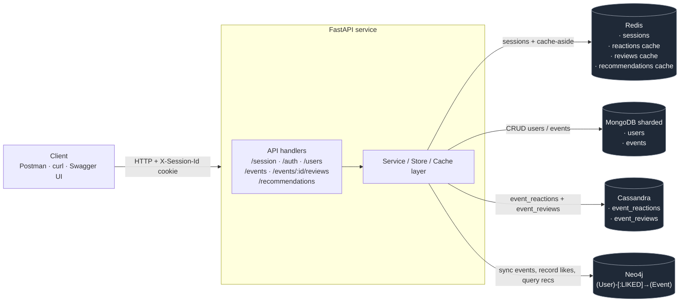

# ndbx-lab

`ndbx-lab` — это FastAPI-приложение для выполнения лабораторных работ по курсу NoSQL.

Проект запускается в Docker, использует Redis для сессий и кэша, шардированный MongoDB для пользователей и событий, Cassandra для реакций и отзывов, Neo4j для графа рекомендаций.

## Что есть в проекте

- FastAPI-приложение со `src`-структурой
- запуск через Docker Compose
- конфигурация через `.env.local`
- Redis для пользовательских сессий и Cache-Aside
- MongoDB для коллекций `users` и `events`
- Swagger UI для ручной проверки API
- Postman-коллекция для тестирования запросов
- Cassandra для таблиц `event_reactions` и `event_reviews`
- Neo4j для графа `User`/`Event`/`LIKED` и рекомендаций

## Технологии

- Python
- FastAPI
- Redis
- MongoDB
- Docker Compose
- Cassandra
- Neo4j

## Запуск

Перед запуском проверьте настройки в `.env.local`.

Локальное развёртывание после клонирования или обновления репозитория:

```bash
git clone https://github.com/entozhevlad/ndbx-lab.git
cd ndbx-lab
uv sync --group dev
make run
```

Для уже склонированного репозитория перед запуском достаточно выполнить `git pull`.

`make run` поднимает приложение и все хранилища через Docker Compose. Если инфраструктура уже запущена отдельно, приложение можно стартовать локально:

```bash
PYTHONPATH=src uv run python -m app.main
```

Запуск в фоне:

```bash
make run
```

Запуск с логами в текущем терминале:

```bash
make rund
```

Проверка статуса контейнеров:

```bash
make services
```

Остановка:

```bash
make stop
```

После запуска приложение доступно по адресу [http://localhost:8080](http://localhost:8080), Swagger UI — [http://localhost:8080/docs](http://localhost:8080/docs).

## Конфигурация

Проект использует `.env.local` как основной источник конфигурации.

Основные переменные окружения:

- `APP_HOST` — хост приложения
- `APP_PORT` — порт приложения
- `APP_USER_SESSION_TTL` — TTL пользовательской сессии
- `APP_USER_SESSION_CREATE_MAX_ATTEMPTS` — число попыток создания новой сессии
- `APP_USER_SESSION_STORE_RETRY_ATTEMPTS` — число повторов Redis-операций при конфликте записи
- `REDIS_HOST` — хост Redis
- `REDIS_PORT` — порт Redis
- `REDIS_PASSWORD` — пароль Redis
- `REDIS_DB` — номер Redis database
- `MONGODB_HOST` — хост MongoDB
- `MONGODB_PORT` — порт MongoDB
- `MONGODB_USER` — пользователь MongoDB
- `MONGODB_PASSWORD` — пароль MongoDB
- `MONGODB_DATABASE` — имя базы MongoDB
- `CASSANDRA_HOSTS`, `CASSANDRA_PORT`, `CASSANDRA_KEYSPACE`, `CASSANDRA_CONSISTENCY` — подключение к Cassandra
- `APP_LIKE_TTL` — TTL кэша счётчиков реакций (секунды)
- `APP_EVENT_REVIEWS_TTL` — TTL кэша агрегатов отзывов (секунды)
- `NEO4J_URL` — bolt-адрес Neo4j (`bolt://neo4j:7687`)
- `NEO4J_USERNAME`, `NEO4J_PASSWORD` — креды Neo4j
- `APP_RECOMMENDATIONS_TTL` — TTL кэша рекомендаций (секунды)

Если `REDIS_PASSWORD` задан, он используется и приложением, и контейнером Redis. Пара `MONGODB_USER` / `MONGODB_PASSWORD` опциональна: если оставить их пустыми, MongoDB поднимается без авторизации.

## Текущая функциональность

### `GET /health`

Проверка работоспособности сервиса.

Ответ:

```json
{"status":"ok"}
```

### `POST /session`

Endpoint для создания и обновления анонимной пользовательской сессии.

### `POST /users`

Регистрация пользователя. Создаёт пользователя в MongoDB, хеширует пароль через `bcrypt`, создаёт новую сессию и привязывает её к `user_id`.

### `POST /auth/login`

Логин по `username` и `password`. Повторно использует активную сессию из cookie или создаёт новую, если старая истекла.

### `POST /auth/logout`

Удаляет Redis-сессию и очищает cookie `X-Session-Id`.

### `POST /events`

Создание события доступно только авторизованному пользователю. События сохраняются в MongoDB.

### `GET /events`

Просмотр событий с фильтрацией по подстроке `title` и пагинацией через `limit` / `offset`. Параметр `?include=reactions,reviews` добавляет к каждому событию агрегаты лайков/отзывов.

### `POST /events/{event_id}/like` / `POST /events/{event_id}/dislike`

Реакции на мероприятие. Лайки попадают как в Cassandra (`event_reactions`), так и в граф Neo4j как связь `(User)-[:LIKED]->(Event)`. Дизлайки в граф рекомендаций не учитываются.

### Отзывы (`/events/{event_id}/reviews`)

`POST`/`GET`/`PATCH` для отзывов на мероприятие. Хранятся в Cassandra, агрегаты — в Redis.

### `GET /recommendations`

Рекомендованные мероприятия для авторизованного пользователя. Берёт пользователей, которые лайкали те же события, и предлагает их остальные лайки (исключая уже лайкнутые), сортирует по популярности (числу совпадений) и дедуплицирует по `title`, оставляя ближайшее по дате старта. Результат кэшируется в Redis (`user:{user_id}:recomms`) на `APP_RECOMMENDATIONS_TTL` секунд по схеме Cache-Aside.

Сессии:

- хранятся в Redis
- используют cookie `X-Session-Id`
- имеют TTL
- сохраняются по ключу `sid:{session_id}`
- могут содержать поле `user_id` для авторизованного пользователя

Коллекции MongoDB:

- `users`: `full_name`, `username`, `password_hash`
- `events`: `title`, `description`, `location.address`, `created_at`, `created_by`, `started_at`, `finished_at`

## Архитектура



Каждое хранилище отвечает за свою область:

- **Redis** — TTL-сессии (`sid:{...}`) и Cache-Aside для агрегатов лайков, рейтингов и рекомендаций.
- **MongoDB (sharded)** — основное хранилище пользователей и мероприятий.
- **Cassandra** — широкие таблицы реакций и отзывов с шардированием по `event_id`.
- **Neo4j** — граф `User-[:LIKED]->Event`, по которому строятся рекомендации (Cypher-запрос находит «похожих» пользователей и их лайки).

Приложение построено послойно, чтобы HTTP-часть, бизнес-логика и работа с Redis были разделены.

- `src/app/main.py` и `src/app/service.py` отвечают за создание FastAPI-приложения, загрузку конфигурации и инициализацию Redis и MongoDB в lifecycle
- `src/app/routers.py` и `src/app/api/` содержат HTTP-роуты и обработчики запросов
- `src/app/session/service.py` содержит бизнес-логику сессий: создать новую сессию или обновить существующую
- `src/app/session/store.py` изолирует работу с Redis: хранение, обновление TTL и запись метаданных сессии, включая `user_id`
- `src/app/session/bootstrap.py` собирает session-модуль и связывает service со store
- `src/app/users/` и `src/app/events/` разделяют бизнес-логику и доступ к MongoDB для пользователей и событий
- `src/app/auth/service.py` связывает логин/логаут с пользователями и Redis-сессиями
- `src/app/mongodb/bootstrap.py` инициализирует MongoDB и создаёт индексы
- `src/app/cassandra/bootstrap.py` поднимает подключение к Cassandra (схема — в `scripts/cassandra/`)
- `src/app/neo4j/bootstrap.py` поднимает драйвер Neo4j (схема — в `scripts/neo4j/`)
- `src/app/reactions/`, `src/app/reviews/` — store/service/cache для реакций и отзывов
- `src/app/recommendations/` — store (Neo4j), cache (Redis) и сервис рекомендаций
- `src/app/user_session.py` содержит утилиты для cookie, sid и Redis key format

Поток запроса выглядит так:

1. HTTP-запрос приходит в handler.
2. Handler достает данные из cookie и обращается к session service.
3. Для `users`, `auth` и `events` handler дополнительно вызывает соответствующий service.
4. Session store выполняет операции в Redis, а MongoDB store — операции с документами.
5. Handler формирует HTTP-ответ и устанавливает cookie при необходимости.

## Проверка API

### Swagger

Swagger UI доступен по адресу [http://localhost:8080/docs](http://localhost:8080/docs).

### curl

Пример запроса на создание сессии:

```bash
curl -i -c /tmp/ndbx.cookies -X POST http://localhost:8080/session
```

Регистрация пользователя:

```bash
curl -i -c /tmp/ndbx.cookies \
  -H 'Content-Type: application/json' \
  -d '{"full_name":"Джон Доу","username":"j0hnd0e42","password":"<your_password>"}' \
  -X POST http://localhost:8080/users
```

Логин:

```bash
curl -i -b /tmp/ndbx.cookies -c /tmp/ndbx.cookies \
  -H 'Content-Type: application/json' \
  -d '{"username":"j0hnd0e42","password":"<your_password>"}' \
  -X POST http://localhost:8080/auth/login
```

Создание события:

```bash
curl -i -b /tmp/ndbx.cookies \
  -H 'Content-Type: application/json' \
  -d '{"title":"Мой день рождения","address":"г. Санкт-Петербург","started_at":"2026-04-01T12:00:00+03:00","finished_at":"2026-04-01T23:00:00+03:00","description":"Приглашаю вас"}' \
  -X POST http://localhost:8080/events
```

Просмотр событий:

```bash
curl -i "http://localhost:8080/events?title=день&limit=10&offset=0"
```

Проверка health-check:

```bash
curl -i http://localhost:8080/health
```

### Postman

В проекте есть Postman-коллекция и окружение для smoke-проверок:

- [api_tests_collection.json](src/tools/api_tests_collection.json)
- [api_smoke_environment.json](src/tools/api_smoke_environment.json)

Чтобы прогнать смоки в Postman, импортируйте оба файла, выберите окружение `ndbx-lab-smoke` и запустите коллекцию через Run collection. Коллекция сама сохраняет временные `eventId`, `userId` и `reviewId`, поэтому ее можно запускать повторно на уже заполненной базе.

Коллекция проверяет:

- `POST /session`
- `GET /health`
- `POST /users`, `GET /users`, `GET /users/{user_id}`, `GET /users/{user_id}/events`
- `POST /auth/login`, `POST /auth/logout`
- `POST /events`, `GET /events`, `GET /events/{event_id}`, `PATCH /events/{event_id}`
- `POST /events/{event_id}/like`, `POST /events/{event_id}/dislike`
- `POST /events/{event_id}/reviews`, `GET /events/{event_id}/reviews`, `PATCH /events/{event_id}/reviews/{review_id}`
- `GET /recommendations`

## Качество кода

Для локальной проверки используется `make lint`. Команда объединяет:

- `isort` — проверяет порядок и группировку импортов
- `mypy` — проверяет типы в `src`
- `ruff` — проверяет стиль и типовые ошибки Python-кода

Для автоматической проверки перед коммитом настроен `pre-commit`; установить hook можно командой `uv run pre-commit install`.

## Структура проекта

- `src/app/` — приложение и основная бизнес-логика
- `src/app/api/` — HTTP handlers
- `src/app/session/` — логика сессий и работа с Redis
- `src/app/users/` — пользователи и доступ к коллекции `users`
- `src/app/events/` — события и доступ к коллекции `events`
- `src/app/auth/` — логика логина и логаута
- `src/app/mongodb/` — инициализация MongoDB и индексов
- `src/tools/` — вспомогательные артефакты, включая Postman-коллекцию
- `docker-compose.yml` — запуск приложения, Redis и MongoDB
- `.env.local` — конфигурация окружения
- `Makefile` — команды для запуска и остановки проекта

## Назначение репозитория

Этот репозиторий используется как рабочий проект для лабораторных работ по NoSQL. По мере выполнения следующих лабораторных работ функциональность приложения может расширяться, а README и документация будут обновляться вместе с проектом.
